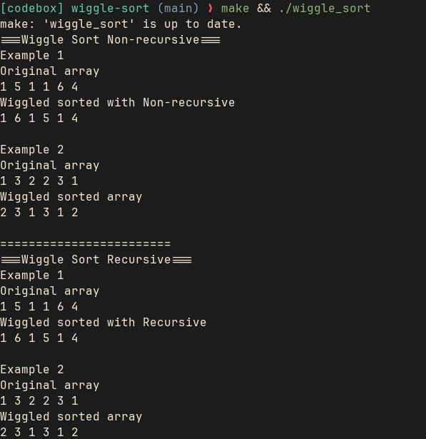

# Wiggle Sort
A simple implementation of wiggle sort written in c with both approaches
- Recursive
- Non-recursive


## Prerequisites
- gcc
- make

## Quick Start

> Linux way
```sh
make
./wiggle_sort
```


> Windows way
```sh
make
./wiggle_sort.exe
```

## Screenshots


